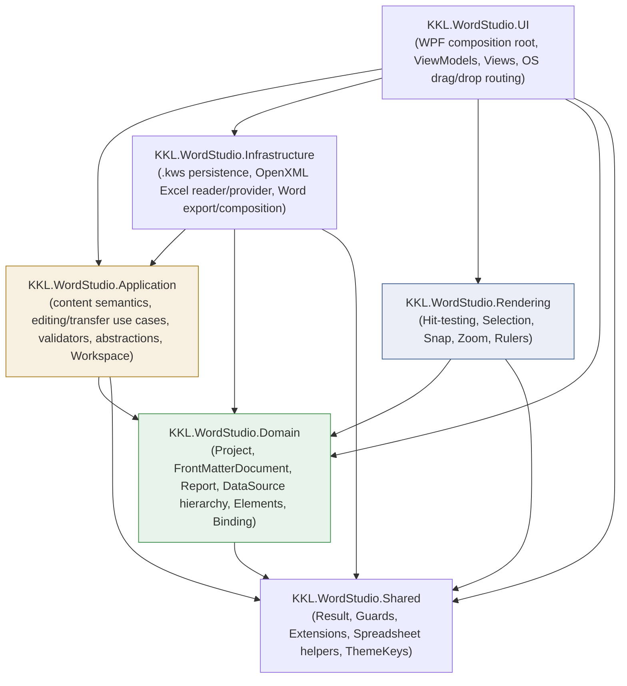
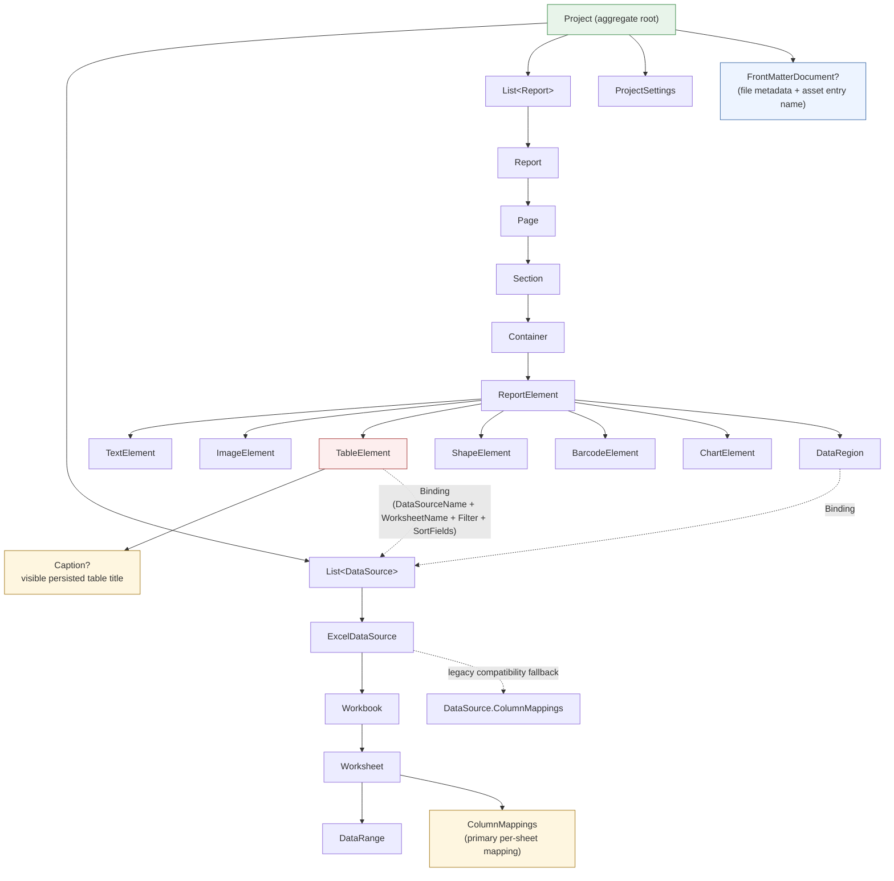
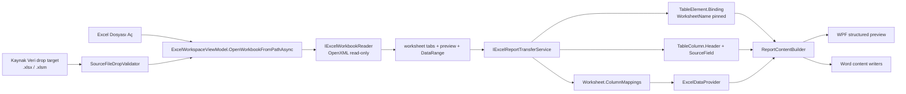
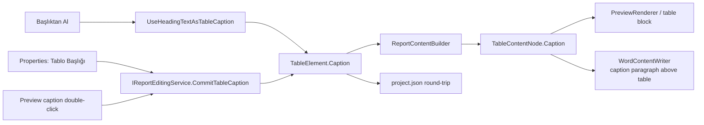
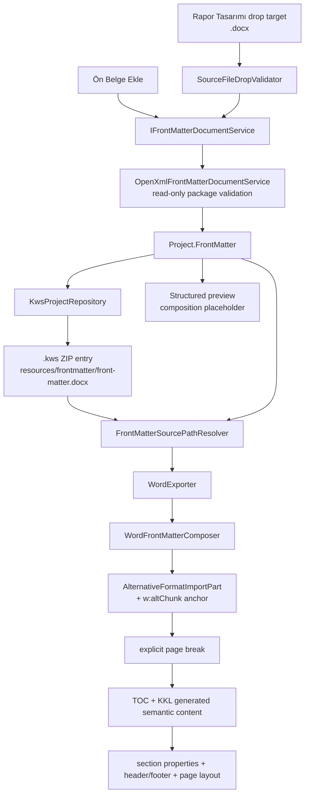

# KKL Word Studio — Architecture Diagram (post Sprint 8)

## Layer dependency graph

`Domain` remains framework- and I/O-free. File existence/package validation and front-matter path resolution live in Infrastructure. WPF code-behind only routes OS drag/drop gestures; validation decisions and actual open/import use cases remain outside pixel-level UI code.

## Domain model (Sprint 8)

Sprint 8 corrects mapping ownership locally: `Worksheet.ColumnMappings` is authoritative for configured worksheet datasets. `DataSource.ColumnMappings` remains only as a pre-Sprint-8 persistence/runtime fallback so older `.kws` projects continue to resolve.

## Excel intake and report semantic flow

The drag/drop path deliberately converges on the same `OpenWorkbookFromPathAsync` workflow as the picker and Project Explorer navigation. The original spreadsheet is opened read-only; Sprint 8 adds no Excel working-data editor.

## Table caption flow

`Başlıktan Al` copies the current Heading/AltHeading text by value. It does not create a live cross-element reference and does not delete or move the source heading.

## Front-matter ownership and final Word composition

The composer does **not** clone source `Body` children into the generated package. The full imported DOCX is fed into an `AlternativeFormatImportPart`; the destination body receives only the `w:altChunk` anchor followed by an explicit page break. This keeps Sprint 8 composition narrow and avoids implementing a generic style/numbering/media/relationship merge engine.

The WPF preview intentionally shows a composition placeholder rather than claiming Word rendering fidelity or page counts. Final DOCX composition is authoritative.
